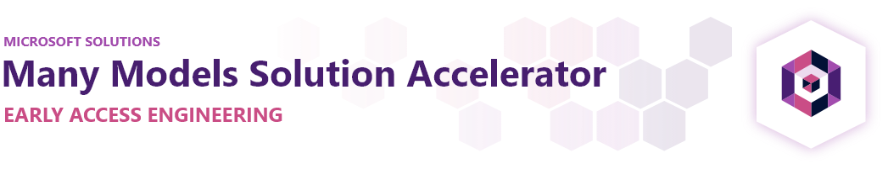
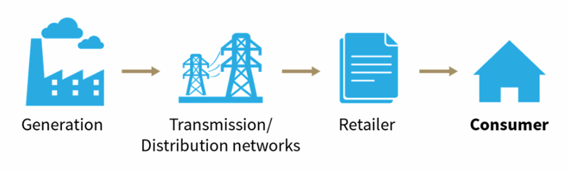
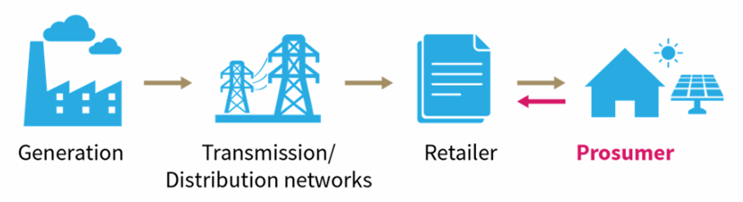
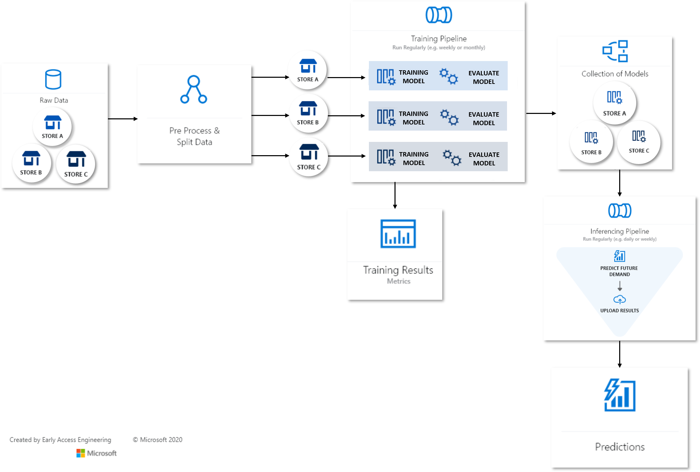

# Energy Many Models Solution Accelerator

<!-- 
Guidelines on README format: https://review.docs.microsoft.com/help/onboard/admin/samples/concepts/readme-template?branch=master

Guidance on onboarding samples to docs.microsoft.com/samples: https://review.docs.microsoft.com/help/onboard/admin/samples/process/onboarding?branch=master

Taxonomies for products and languages: https://review.docs.microsoft.com/new-hope/information-architecture/metadata/taxonomies?branch=master
-->

When you turn the lights; have you ever wondered where that energy comes from? Too often, we take for granted the complex nature of the energy grid and how a simple light switch triggers a cascade of events. 

And the grid is becoming more complex! With more solar and batteries being installed in both commercial and residential places; The energy market is rapidly changing and the need to be able to forecast accurately becomes evident as consumers transition themselves to the new 'prosumer'; producing energy and participating actively in the grid. 

Reference: [Advisian.com](https://www.advisian.com/en-us/global-perspectives/energy-consumer-to-energy-prosumer)

Traditional Retailers and Energy generators that participate in the grid have to adapt to these new players and this where technology comes to meet the demand and adapt fo these new changes. 

## How does this work

This Energy Many-Models solution accelerator inherits much from the generic Many-Models Solution Accelerator. We create mulitple time-series Solar Generating/Energy Consuming datasets from an original real-world dataset. 

The training of the model occurs in two ways

1. Custom Models - in this case we use a simple Linear Regression Model
2. AutoML - where AutoML is used to determine the best model for every single home

The deployment of the model is also via two ways

1. Batch Scoring - For both Custom Models and AutoML OR
1. Real Time Scoring, with AKS Clusters - only for Custom Models

## Prerequisites

To use this solution accelerator, all you need is access to an [Azure subscription](https://azure.microsoft.com/free/) and an [Azure Machine Learning Workspace](https://docs.microsoft.com/azure/machine-learning/how-to-manage-workspace) that you'll create below.

While it's not required, a basic understanding of Azure Machine Learning will be helpful for understanding the solution. The following resources can help introduce you to AML:

1. [Azure Machine Learning Overview](https://azure.microsoft.com/services/machine-learning/)
2. [Azure Machine Learning Tutorials](https://docs.microsoft.com/azure/machine-learning/tutorial-1st-experiment-sdk-setup)
3. [Azure Machine Learning Sample Notebooks on Github](https://github.com/Azure/MachineLearningNotebooks)

## Getting started

### 1. Deploy Resources

Start by deploying the resources to Azure. The button below will deploy Azure Machine Learning and its related resources:

### 2. Configure Development Environment

Next you'll need to configure your [development environment](https://docs.microsoft.com/azure/machine-learning/how-to-configure-environment) for Azure Machine Learning. We recommend using a [Notebook VM](https://docs.microsoft.com/azure/machine-learning/how-to-configure-environment#compute-instance) as it's the fastest way to get up and running. Follow the steps in [EnvironmentSetup.md](./EnvironmentSetup.md) to create a Notebook VM and clone the repo onto it.

### 3. Run Notebooks

Once your development environment is set up, run through the Jupyter Notebooks sequentially following the steps outlined. By the end, you'll know how to train, score, and make predictions using the many models pattern on Azure Machine Learning.

There are two ways to train many models:

1. Using a custom training script
2. Using Automated ML

However, the steps needed to set the workspace up and prepare the datasets are the same no matter which option you choose.

## Contents

In this repo, you'll train and score a forecasting model for each suburb and each home (simulated). At the moment this is limited to 50 homes (or models) but can scale as needed. 

This dataset was obtained from a digital energy meter in Australia from a home in Sydney with 21 solar panels (6.6kw system) on the roof with a maximum inverter output of 5kw. The energy consumption is a typical 4 person household, with a 13KW reverse-cycle ducted air-conditioning system as the largest electrical consumer in the home. 

This dataset ranges from June 2019 to July 2020.

This particular source was obtained from Endevaour Energy and proof of ownership of the NMI meter is required.

An example of this form is as follows [click here](https://www.endeavourenergy.com.au/CADMeterData/webengine/consumer/MeterDataForm)

<!--
    
-->

The functionality is broken into the notebooks folders designed to be run sequentially.

### Before training the models

| Notebook       | Description                                |
|----------------|--------------------------------------------|
| `00_Setup_AML_Workspace.ipynb`  | Creates and configures the AML Workspace, including deploying a compute cluster for training. |
| `00_VisualizationNotebook.ipynb`| Creates Visualizations of the original dataset, some graphs to provide a better understanding of the data | 
| `01_Data_Preparation.ipynb`     | Prepares the datasets that will be used during training and forecasting. |

### Using a custom training script to train the models:

The following notebooks are located under the [`Custom_Script/`](Custom_Script/) folder.

| Notebook       | Description                                |
|----------------|--------------------------------------------|
| `02_CustomScript_Training_Pipeline.ipynb`    | Creates a pipeline to train a model for each home and suburb in the dataset using a custom script. |
| `03_CustomScript_Forecasting_Pipeline.ipynb` | Creates a pipeline to forecast future solar production patterns using the models trained in the previous step.|

### Using Automated ML to train the models:

The following notebooks are located under the [`Automated_ML/`](Automated_ML/) folder.

| Notebook       | Description                                |
|----------------|--------------------------------------------|
| `02_AutoML_Training_Pipeline.ipynb`    | Creates a pipeline to train a model for each home and suburb in the dataset using Automated ML.  |
| `03_AutoML_Forecasting_Pipeline.ipynb` | Creates a pipeline to forecast future solar production patterns using the models trained in the previous step.  |

## How-to-videos

Watch these how-to-videos for a step by step walk-through of the many model solution accelerator to learn how to setup your models using both the custom training script and Automated ML.

### Custom Script

### Automated ML

## Key concepts

### ParallelRunStep

[ParallelRunStep](https://docs.microsoft.com/en-us/python/api/azureml-pipeline-steps/azureml.pipeline.steps.parallel_run_step.parallelrunstep?view=azure-ml-py) enables the parallel training of models and is commonly used for batch inferencing. This [document](https://docs.microsoft.com/azure/machine-learning/how-to-use-parallel-run-step) walks through some of the key concepts around ParallelRunStep.

### Pipelines

[Pipelines](https://docs.microsoft.com/azure/machine-learning/concept-ml-pipelines) allow you to create workflows in your machine learning projects. These workflows have a number of benefits including speed, simplicity, repeatability, and modularity.

### Automated Machine Learning

[Automated Machine Learning](https://docs.microsoft.com/azure/machine-learning/concept-automated-ml) also referred to as automated ML or AutoML, is the process of automating the time consuming, iterative tasks of machine learning model development. It allows data scientists, analysts, and developers to build ML models with high scale, efficiency, and productivity all while sustaining model quality.

### Other Concepts

In additional to ParallelRunStep, Pipelines and Automated Machine Learning, you'll also be working with the following concepts including [workspace](https://docs.microsoft.com/azure/machine-learning/concept-workspace), [datasets](https://docs.microsoft.com/azure/machine-learning/concept-data#datasets), [compute targets](https://docs.microsoft.com/azure/machine-learning/concept-compute-target#train), [python script steps](https://docs.microsoft.com/python/api/azureml-pipeline-steps/azureml.pipeline.steps.python_script_step.pythonscriptstep?view=azure-ml-py), and [Azure Open Datasets](https://azure.microsoft.com/services/open-datasets/).

## Contributing

This project welcomes contributions and suggestions. To learn more visit the [contributing](CONTRIBUTING.md) section.

Most contributions require you to agree to a Contributor License Agreement (CLA)
declaring that you have the right to, and actually do, grant us
the rights to use your contribution. For details, visit https://cla.opensource.microsoft.com.

When you submit a pull request, a CLA bot will automatically determine whether you need to provide
a CLA and decorate the PR appropriately (e.g., status check, comment). Simply follow the instructions
provided by the bot. You will only need to do this once across all repos using our CLA.

This project has adopted the [Microsoft Open Source Code of Conduct](https://opensource.microsoft.com/codeofconduct/).
For more information see the [Code of Conduct FAQ](https://opensource.microsoft.com/codeofconduct/faq/) or
contact [opencode@microsoft.com](mailto:opencode@microsoft.com) with any additional questions or comments.

## Acknowledgements

This project was not possible without the contributions of the following individuals

1. Nicholas Moore <nicholas.moore@microsoft.com>
1. Malory Rose <malory.rose@microsoft.com>
1. Maria Medina <maria.medina@microsoft.com>
1. Nalini Chandhi <nalini.chandhi@microsoft.com>
1. Scott Donohoo <sdonohoo@microsoft.com>
1. Julian Lee <julian.lee@microsoft.com>

